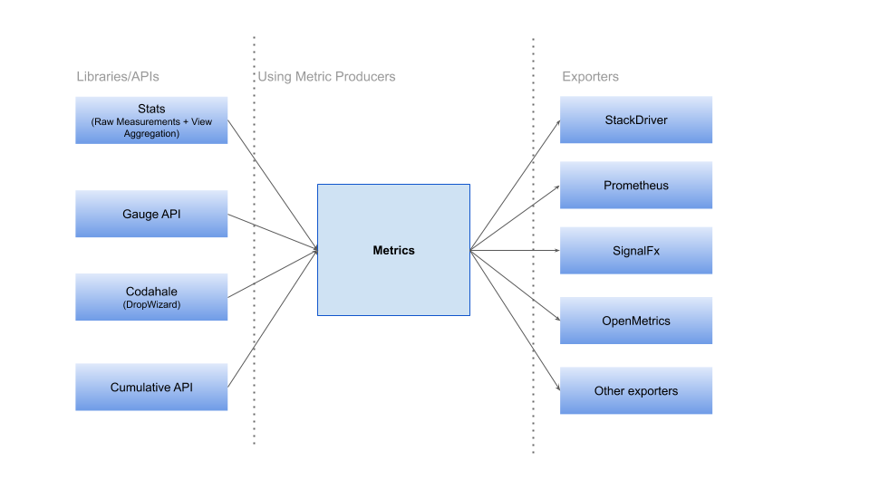

# OpenCensus Library Metrics Package
This documentation serves to document the "look and feel" of the open source metrics package. It 
describes the key types and the overall behavior.

Note: This is an experimental package and is likely to get backwards-incompatible updates in the future.

## Main APIs
* [Metrics Data Model](Metrics.md): defines the metrics data model.

## Stats vs Metrics

[Stats](../stats/README.md) Library allows users to record raw measurements or data without any aggregations. It also allows users to define views to configure how data are aggregated and broken down (using tags). In short, Stats is an API for recording raw measurements.

[Metrics](Metrics.md) is an API that works with aggregated data. Metrics is a data model for what stats exporters take as input. Different exporters have different capabilities (e.g. which data types are supported) and different constraints (e.g. which characters are allowed in label keys). Metrics is intended to be a superset of what's possible, not a lowest common denominator that's supported everywhere.

### When should I use Stats?
* Stats are a very good match for RPC and HTTP metrics where the framework developer does not know all the available dimensions (tags) or how to configure the right histogram.
* Stats can produce only cumulative metrics (record only positive values).
* Recorded Stats can correlated with trace if user exports Histograms.
* Stats allows users to propagate dimensions from different process.
* Stats allows framework developers to not enforce the aggregation (e.g. configuring the histograms) or if some metrics are exported or not.

### When should I use Metrics?
* Metrics APIs are for exporting and consuming aggregated metrics. For example, total CPU usage, current Memory usage, cache misses, etc.
* [Gauge](./Gauge.md) should be used for already aggregated metrics that can go up and down.
* [Cumulative](./Cumulative.md) should be used to already aggregated metrics that represents a single numerical value accumulated over a time interval. It can record only positive and increasing values.
* Cumulative should be used for simple metrics that have a predefined set of dimensions (known at the record time). E.g. number of elements added to a queue. Cumulatives have less overhead but also less flexibility compare with Stats.

### Who produces Metrics Data?
* [Stats](../stats/README.md) API - This will produce Metrics, when they are applied across a set of measurements.
* [Gauge](./Gauge.md) API - OpenCensus provides a Gauges API to report instantaneous measurements of a value. As this is already aggregated data, it makes sense to report and represent them as a Metrics.
* [Cumulative](./Cumulative.md) API - This is also already aggregated data and another source for Metrics.
* Codahale and Dropwizard5 Integration - We use the Metric data model to transform data from the Dropwizard library to the OpenCensus library. More info about how we translate or convert Dropwizard metrics to OpenCensus is available [here](https://github.com/census-instrumentation/opencensus-java/blob/master/contrib/dropwizard/README.md).

### Who consumes Metrics Data?
All the stats exporters are modified or have to be modifed to consume data from Metrics Data model using Metric Producer Manager (which keeps a set of Metric Producers, used by exporters to determine the metrics that need to be exported).

